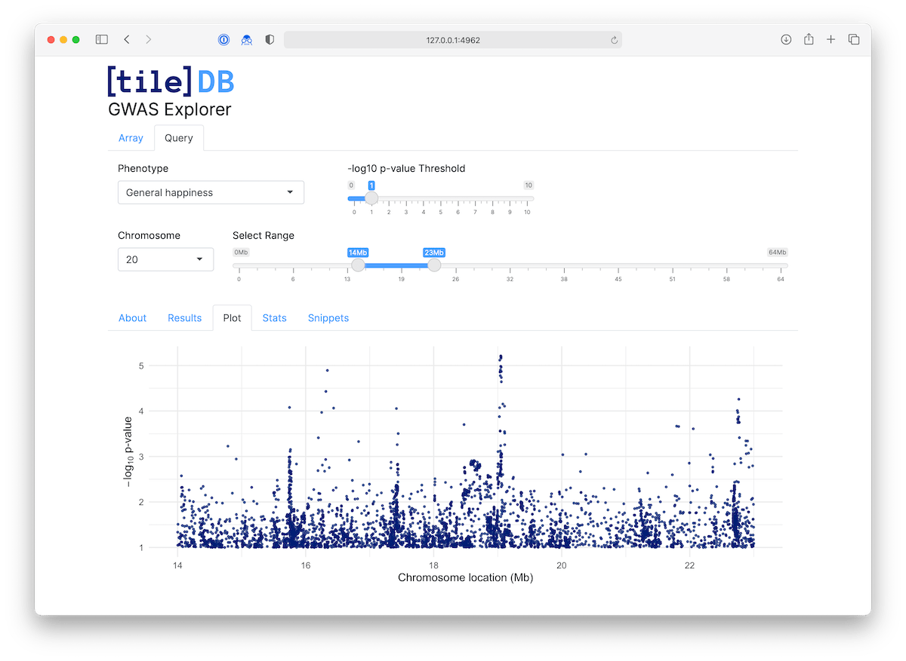

# gwas explorer

Explore UKBiobank GWAS results stored in an S3 TileDB array.



## Installation

You can install the latest release of gwasexplorer from GitHub:

``` r
remotes::install_github("tiledb-inc/gwasexplorer", remotes::github_release())
```

## Citation
UK Biobank GWAS Results: Neale Lab, <http://www.nealelab.is/uk-biobank/>, 2018.

